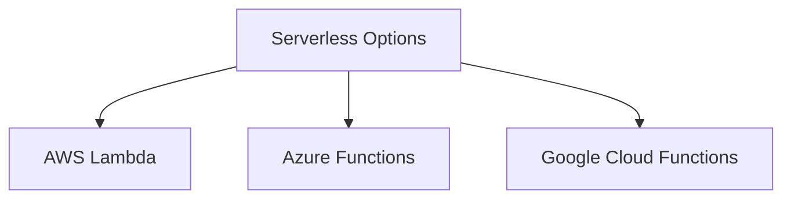

# Serverless Architecture Options

## Current Deployment (Vercel)

- **Frontend**: Deployed separately to Vercel
- **Backend**: Deployed separately to Vercel
- **Git Repos**: Separate repositories for frontend and backend

## Comparison of Major Providers (Alternative Options)

### AWS Lambda

- **Pros**:
  - Mature platform with extensive features
  - Tight integration with other AWS services
  - Supports multiple languages (Node.js, Python, etc.)
- **Cons**:
  - Cold start latency
  - Complex pricing model
- **Best For**: Projects already using AWS ecosystem

### Azure Functions

- **Pros**:
  - Excellent .NET Core support
  - Good Visual Studio integration
  - Durable Functions for stateful workflows
- **Cons**:
  - Fewer language options than AWS
- **Best For**: Microsoft-centric environments

### Google Cloud Functions

- **Pros**:
  - Simple pricing
  - Fast cold starts
  - Good Node.js support
- **Cons**:
  - Less mature than AWS/Azure
- **Best For**: Projects using Google Cloud services

## Vercel-Specific Considerations

1. **API Routes**:

   - Can use Vercel Serverless Functions
   - Files in /api directory automatically become endpoints
   - Supports Node.js, Python, Go

2. **Environment Variables**:

   - Configured in Vercel dashboard
   - Available to both frontend and backend

3. **Deployment**:
   - Automatic from Git repositories
   - Branch-based preview deployments
   - Custom domains supported

## Implementation Considerations (General)

1. **API Endpoints**:

   - Move existing server logic to /api directory
   - Each function handles a specific endpoint
   - Use API Gateway for routing

2. **Database Access**:

   - Consider serverless database options:
     - AWS DynamoDB
     - Azure Cosmos DB
     - Firebase Firestore

3. **Authentication**:

   - Leverage provider's auth services
   - AWS Cognito, Azure AD, Firebase Auth

4. **Local Development**:
   - Use serverless frameworks for local testing:
     - Serverless Framework
     - AWS SAM
     - Azure Functions Core Tools

## Migration Steps

1. Identify backend functionality to migrate
2. Create /api directory structure
3. Implement functions for each endpoint
4. Set up CI/CD pipeline
5. Gradually migrate functionality

## Cost Estimates (Monthly)

| Provider         | 1M Requests | Compute Time     | Storage   |
| ---------------- | ----------- | ---------------- | --------- |
| AWS Lambda       | $0.20       | $0.00001667/GB-s | $0.023/GB |
| Azure Functions  | $0.20       | $0.000016/GB-s   | $0.018/GB |
| Google Functions | $0.40       | Included         | $0.026/GB |

---

## Final Recommendation [Finalized: 2025-04-11 16:08 EDT]

**Recommended Provider:** Vercel Serverless Functions

**Rationale:**

- Current deployment is already on Vercel for both frontend and backend.
- Vercel provides seamless integration with Git, automatic deployments, and branch previews.
- Serverless API routes are natively supported via the /api directory.
- Environment variable management is straightforward.
- No additional provider lock-in or migration complexity.

**Open Questions/Blockers:**

- Confirm all backend logic can be migrated to Vercel serverless functions without loss of functionality.
- Review any provider-specific limitations (e.g., cold start, execution timeouts).
- Ensure all environment variables and secrets are securely managed.

**Next Step:** Proceed to create a detailed migration plan in memory-bank/serverless-migration-plan.md.

**Status:** Serverless options analysis finalized as of 2025-04-11 16:08 EDT.
