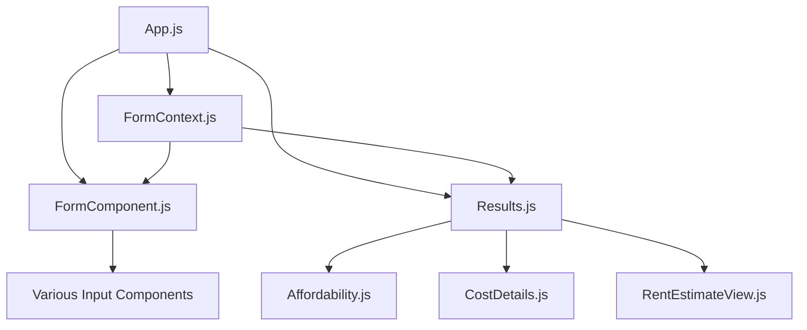

# System Patterns: Apartment Cost Analyzer [Updated: 2025-04-11 04:10 AM]

## Architectural Patterns

- **Component-Based Architecture**:
  - Clear separation between presentation and logic
  - Reusable form input components
  - Dedicated view components for results display
  - Specialized view components like RentEstimateView

## State Management

- **Context API**:
  - Central FormContext manages all application state
  - Provides state and handlers to child components
  - Follows React's unidirectional data flow
  - Extended to support rent estimation data

## Form Handling

- **Modular Input Components**:
  - Each input type has its own component
  - Consistent props interface
  - Located in src/components/forms/
  - Connected to FormContext for state management

## Component Relationships

## Design Principles

- **Single Responsibility**: Each component handles one specific task
- **Composition**: Complex components built from simpler ones
- **Consistent Styling**: CSS modules for component-specific styles
- **Extensibility**: New view components can be added without breaking existing ones
